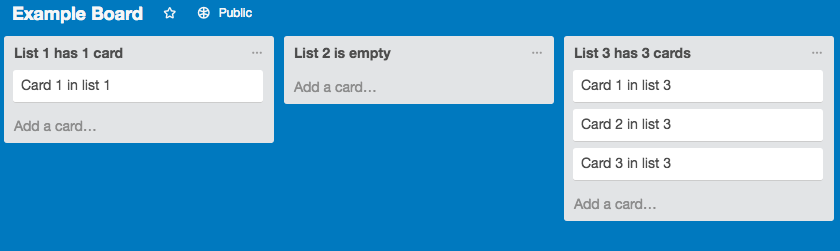

# Pair Programming Exercise: Trello CSV Download and Uploader

## Goal

The goal of this exercise is to build a script for uploading and downloading Trello boards as CSV files. This will give you experience with using API's inside node and dealing with files and the file system.

## Instructions

You will be building a single script `trello-csv.js` to download and upload Trello boards as CSV files.

This script has two modes of operation:

1. Upload given CSV file to a Trello board
  ```bash
  node trello-csv --upload [board id] [csv file]
  OR
  node trello-csv -u [board id] [csv file]
  ```
1. Download a given Trello board to a CSV file
  ```bash
  node trello-csv --download [board id] [csv file]
  OR
  node trello-csv -d [board id] [csv file]
  ```

### File format

csv stands for comma-separated values. Each line is a row and rows are broken up into columns using commas.

In our case we will be using the first row (i.e. line) to represent all the list names in a Trello board. Each
subsequent line represents cards in the corresponding list.

The first item in every row belongs to the first list and the second item belongs to the second and so on.

This board


Becomes
```
List 1 has 1 card,List 2 is empty,List 3 has 3 cards
Card 1 in list1,,Card 1 in list 3
,,Card 2 in list 3
,,Card 3 in list 3
```

There's a sample csv file included with this folder, [`sample.csv`](sample.csv). You can use the NPM package [`csv`](https://www.npmjs.com/package/csv) for parsing csv files.

### Upload

When you upload to a Trello board you lists should be added to the right of all previous lists.

### Download

When you download a Trello board you should retain list and card ordering. You only need to keep list and card names.
