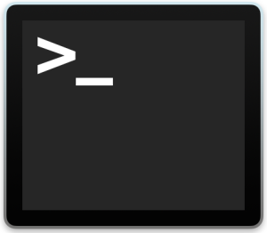

# Warmup exercise: Command Line Environment

## Time limit: 15 minutes

## Goal

The goal of this is to get started with using a Command Line Environment.

## Instructions

### Windows

Ethan TODO

### Mac

1. Open the Terminal application: **Applications > Utilities > Terminal** 
1. Run this command to install [Homebrew](http://brew.sh/):
  ```bash
  /usr/bin/ruby -e "$(curl -fsSL https://raw.githubusercontent.com/Homebrew/install/master/install)"
  ```
1. Install node with Homebrew
  ```bash
  brew install node
  ```
1. Make sure your node installation is working with
  ```bash
  echo "console.log('Node works!')" | node
  ```
  Should print
  ```bash
  Node works!
  ```
