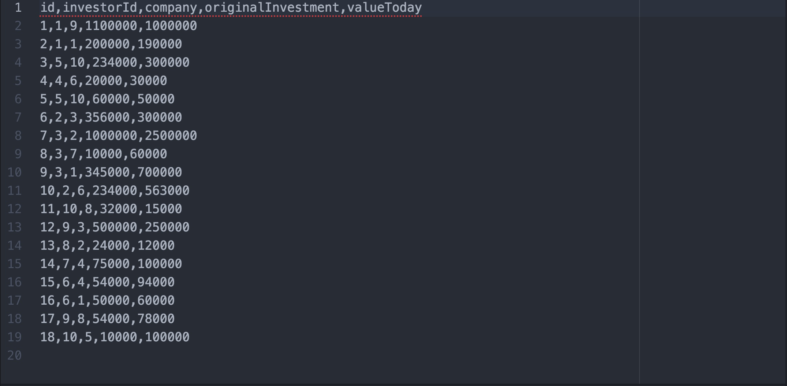
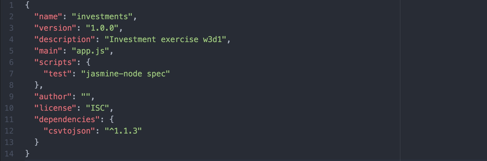
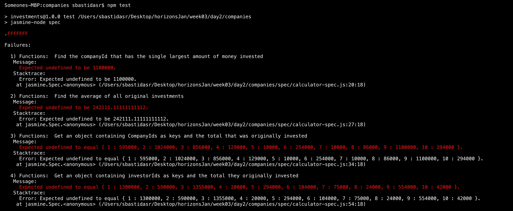

# Pair Programming Exercise: Investment Reports

## Goal

The goal of this exercise is for you to get familiar with node. We will cover the basics about node, files, npm, the package.json file and running your app. You will build an investment report app that takes in two `CSV` files and performs some calculations with the data on the files. CSV stands for "comma-separated values". It is a format to store tables of data such as spreadsheets, by separating each column with a comma.



The first line on a CSV file is usually the header. Ours contains `id, investorId, company, originalInvestment, valueToday`. The header of the file specifies the names of the columns for the table. After the header, a single data entry looks like this: `10, 2, 6, 234000, 563000`. To be able to use it, we will convert them to JSON objects that look like this:


Your app will perform calculations on these JSON objects to find out the best investors, companies with more money and so on.


## Instructions

## Exercise 1: Setting up the project

1. Open up your terminal and navigate to the `week03/day2/companies` directory.
1. Install the [`jasmine-node`](https://www.npmjs.com/package/jasmine-node) NPM
  package for all Node projects on your computer.

  ```
  npm install -g jasmine-node
  ```

  `-g` (short for global) installs a package for all projects. 

1. Add the [`csvjson`](https://github.com/pradeep-mishra/csvjson) NPM package to
   your current project.

   ```
   npm install -s csvjson
   ```

   `-s` (short for save) updates your `package.json` and adds the given package
   to the `dependencies` section.
1. Run `npm install` to install all dependencies listed in your `package.json`.
1. Try running `npm test` in your terminal. Note how this prints out
  `Error: no test specified`. This is because we haven't told NPM how to
  run tests for our project yet.

  Create a new `"scripts"` section to your `package.json`. Inside this section
  set `"test"` to `"jasmine-node spec"`. Your `package.json` should now look
  like:

  

1. Run `npm test` again to verify your tests are now running. If you get a
   similar screen with all the failing/passing tests you are ready to start
   developing!

  

### Exercise 2: Parsing CSVs

TODO

### Exercise 3: Calculating Results

You can now check your tests and see them failing/passing. Open your
`functions.js` file and fill in the functions to perform the different
calculations. Each function has a short description of the expected results and
some hints to achieve them.  

Every time you modify a function or want to check your progress, go to the
command line and run `npm test`.

## Results

By the end of this exercise, you should be familiar with the following concepts:

1. Installing modules to your application using `npm install MODULE_NAME`
1. Running your tests using `npm test`
1. Adding scripts to your `package.json` file.
1. Parsing CSV data and calculating output from it.
