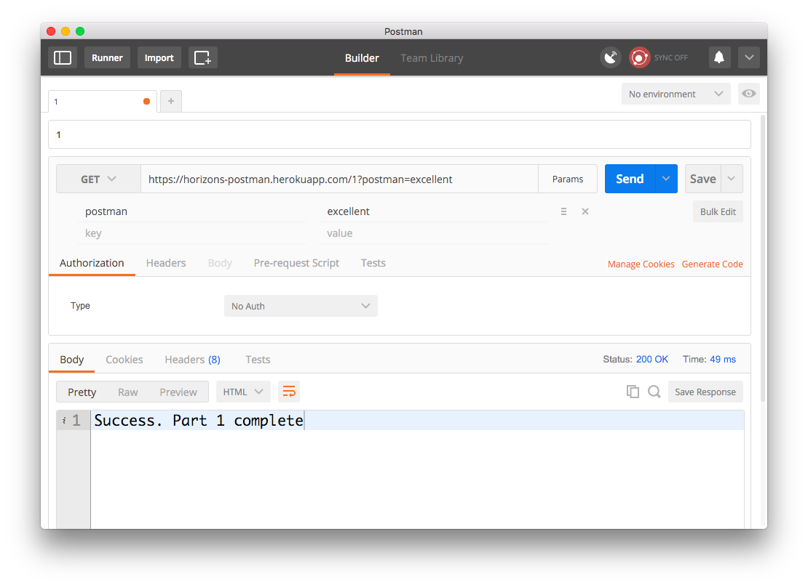
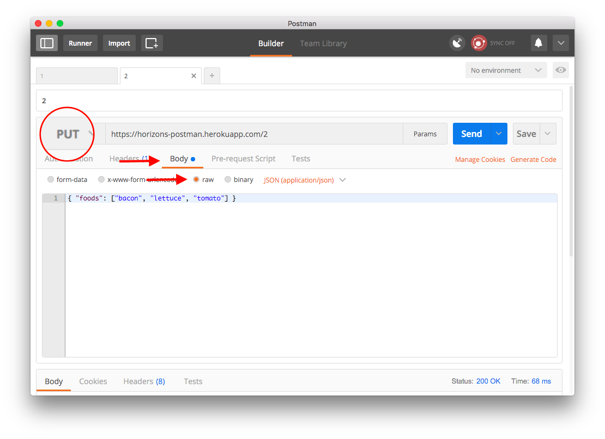
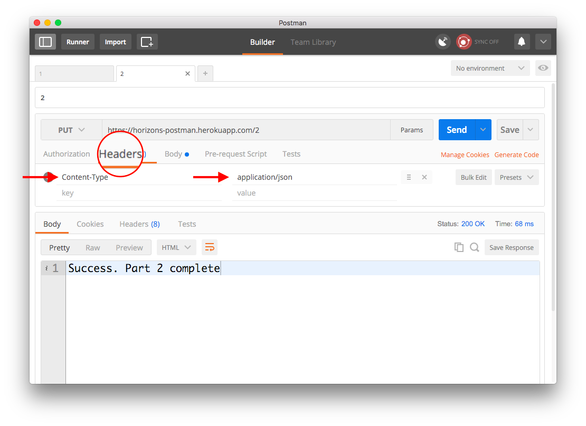

# Express + Postman Self Directed Examples

- **All videos have the password `horizonites`**
- Before you jump in
- Keep [lesson slides](http://lessons.horizonsbootcamp.com/lessons/week03/day2.html)
  open in your browser. Lesson slides contain code samples and links to
  essential documentation.
- You can write all your solutions in the same project. You don't need to
  create a new React Native project for each secion.
- Ask for help early and often! 🙋

### Disclaimer

In terminal navigate to the `/week03/day2/examples/` folder and run the command `npm install`.

### [Watch me: Express Introduction](https://vimeo.com/212322872)
### [Watch me: HTTP Introduction + Postman](https://vimeo.com/212950789)

### Postman (Setup)

[Install Postman](https://www.getpostman.com/) and make a `GET` request to
`https://horizons-postman.herokuapp.com/`

When you are successful you will see a message in the output panel:

```
Great, you're starting the Postman warmup exercise!
```

### Postman (Query Parameters)

First, we're going to get our feet wet by using request parameters and a `GET` request.

Make a `GET` request to `https://horizons-postman.herokuapp.com/1`
(**note the `/1` at the end**) with the request parameter
`postman` set to `excellent`.

You can do this by either editing the URL directly or clicking on `Params` and adding a key and value.

Success message:

```
Success. Part 1 complete
```



### Postman (Methods, Request body, and Content type)

Now we can make a `PUT` request with some JSON contents. We put the contents of the request in the Body section and change the `Content-Type` header so the server knows how to interpret the data.

Make a request to `https://horizons-postman.herokuapp.com/2` using Postman:

1. Set method to `PUT`
1. Set the body to be `raw` add the content `{ "foods": ["bacon", "lettuce", "tomato"] }`
  
1. Set header `Content-Type` to `application/json`
  

Success message:

```
Success. Part 2 complete
```

### Postman (Delete)

Finally, we will `DELETE` `https://horizons-postman.herokuapp.com/3/your/worries` by using HTTP Basic Authentication.

1. Set the method to `DELETE`
1. Open the `Authorization` tab and set mode to `Basic Auth`
1. Set username to `user` and password to `pass`


Success message:

```json
{
  "you": "success",
  "exercise": "complete"
}
```

### HTTP GET Routes

Open `/week03/day2/examples/routes.js` in your favourite text editor and follow these steps:

1. require the `express` library
1. initiaize your express app instance (`var app = express()`)
1. create the following routes:
    - __`GET /`__: Send the string `"The Horizons Poet API v1.0"`.
	- __`GET /api/*`__: Send the string `"We couldn’t find any routes matching this endpoint"`.
	    - `*` denotes any string (i.e. `/api/anything`, `/api/unicorn`, /api/p/r/a/t/h`, etc.)
		- you will need to use `app.use()` for this
	- __`GET /api/poem`__: Send the text from the file `/week03/day2/examples/poem.txt`
	    - use the following code to read `poem.txt`
		    ```js
			var fs = require('fs');
			var poem = fs.readFileSync('./poem.txt', 'utf8');
			```
	- __`POST /api/success`__: Send the json `{success: true}` using [`res.json()`](http://expressjs.com/en/api.html#res.json)
1. listen on port __3000__

__TESTING:__ Use Postman to test your solution!

### [Watch me: HTTP Queries and Parameters](https://vimeo.com/212995568)
### [Watch me: Status Codes](https://vimeo.com/213017476)

1. Open this folder (`week03/day2/examples/express_echo`) in your Terminal on Mac or PowerShell on Windows.
1. Install dependencies with NPM:
	```bash
	npm install
	```
1. Open `app.js` in your editor of choice and add an express http endpoint so that it prints correctly on step 5 (follow the directions in the `app.js` file).
1. Start your server. **Note**: When you change `app.js` you have to restart it to see your changes!
	```bash
	npm start
	```
1. Verify that your code is working correctly by opening [http://localhost:3000/hello?name=Simba](http://localhost:3000/hello?name=Simba) in Chrome. It should print:

	```
	Hello there Simba!
	```
1. Stop your server with <kbd>Control</kbd>+<kbd>C</kbd> in your Terminal/PowerShell.

# [Handlebars](http://handlebarsjs.com/) Self Directed Examples

### [Watch me: Express Templating](https://vimeo.com/213161919)
### [Watch me: If-Else Handlebars](https://vimeo.com/213165829)
### [Watch me: Looping in Handlebars](https://vimeo.com/213169153)
