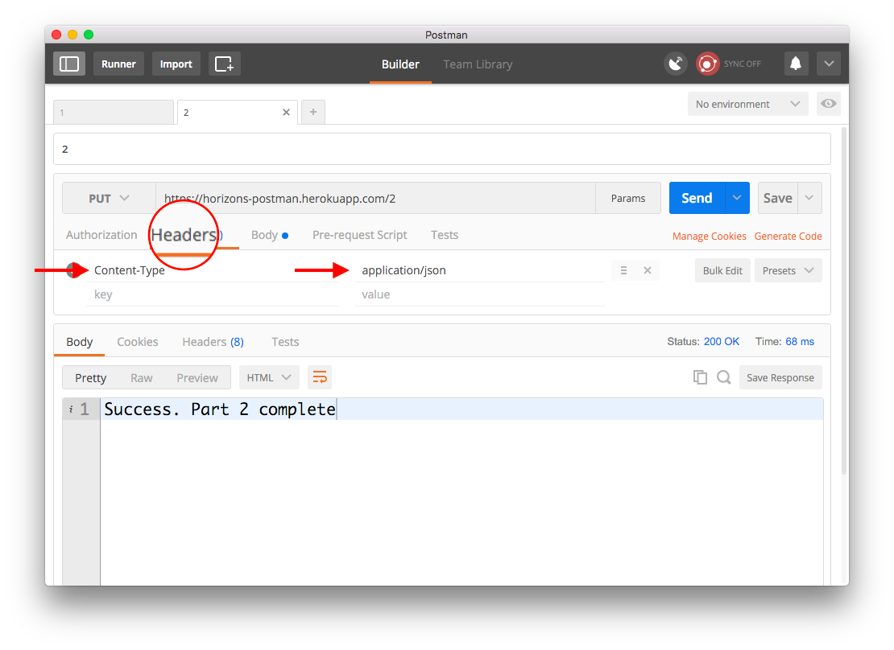

# Exercise: Setup Postman

## Time limit: 15 minutes

## Instructions

### Part 0

[Install Postman](https://www.getpostman.com/) and make a `GET` request to
`https://horizons-postman.herokuapp.com/`

When you are successful you will see a message in the output panel:

```
Great, you're starting the Postman warmup exercise!
```

### Part 1: Query parameters

First, we're going to get our feet wet by using request parameters and a `GET` request.

Make a `GET` request to `https://horizons-postman.herokuapp.com/1`
(**note the `/1` at the end**) with the request parameter
`postman` set to `excellent`.

You can do this by either editing the URL directly or clicking on `Params` and adding a key and value.

Success message:

```
Success. Part 1 complete
```


### Part 2: Methods, request body, and content type

Now we can make a `PUT` request with some JSON contents. We put the contents of the request in the Body section and change the `Content-Type` header so the server knows how to interpret the data.

Make a request to `https://horizons-postman.herokuapp.com/2` using Postman:

1. Set method to `PUT`
1. Set the body to be `raw` add the content `{ "foods": ["bacon", "lettuce", "tomato"] }`
  
1. Set header `Content-Type` to `application/json`
  

Success message:

```
Success. Part 2 complete
```

### Part 3:

Finally, we will `DELETE` `https://horizons-postman.herokuapp.com/3/your/worries` by using HTTP Basic Authentication.

1. Set the method to `DELETE`
1. Open the `Authorization` tab and set mode to `Basic Auth`
1. Set username to `user` and password to `pass`


Success message:

```json
{
  "you": "success",
  "exercise": "complete"
}
```

Congrats! You're done with this warmup exercise.
