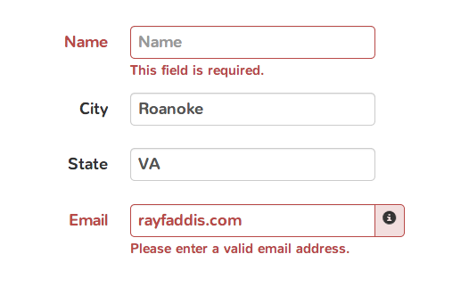

# Pair Programming Exercise: Guestbook

## Goal

The goal of this exercise is to create a basic web application that allows users
to login, view posts and create new posts.

## Instructions

We have created an express app for you. It already handles the basics like
server creation and using a couple of templates. Now, you have to fill in the routes
and templates to build the Guestbook.

### Getting started

1. Install npm dependencies

  ```bash
  npm install
  ```

1. Start your server

  ```bash
  npm start
  ```

1. Visit [http://localhost:3000/login](http://localhost:3000/login) to make sure that your server is working.
1. Edit your routes (aka endpoints) in `routes.js`.
1. Edit your css rules in `public/css/style.css`.
1. when users create posts, save them using `data.save()`. To read data use `data.read()`.

### Your tasks

You should implement the following pieces of functionality:

1. View posts: When the user visits the `/posts` URL, they must be see all the posts
on the system. Fill out the code for the routes and the post.hbs view.
1. View posts from one guest: If the user wants to see the posts from user named
Steven, they visit `/posts?username=steven` This uses the same routes and templates
as the above.
1. Sort posts by date: passing a new parameter to the url: `/posts?order=descending`,
should display all the posts ascending/descending order.
1. Login: When the user navigates to `/login` from a browser (thus making a GET
request), a form must be displayed. After filling and sending the form, they should
receive a cookie so they know they are logged in (POST request). In this case, we'll
just the username as a cookie and no password.
1. Create Post: If a user is logged in, meaning they have a cookie, they must be
able to create posts. Navigating to `/posts/new` should display a form. Sending the
form creates a new post.

A valid post must contain these fields:

1. Author
1. Post date
1. Post title
1. Post body

### Style tasks

Use [Bootstrap](http://getbootstrap.com/) to style your views (i.e. your pages).
You can download Bootstrap into the `public/`. The contents of this folder are accessible
inside pages.

There are three views (i.e. pages) in this app, these are rendered
using [Handlebars Templates](http://handlebarsjs.com/).

1. Login view -> `views/login.hbs`
1. View posts view -> `views/posts.hbs`
1. Create post view -> `views/post_form.hbs`

When creating posts, you should validate input and display validation
errors on the page.

### Bonus Section:

1. Put validation errors inline with form elements that have validation errors.
   Bootstrap supports inline form validation messages like this:

   

1. Render Markdown posts using [Marked](https://github.com/chjj/marked)
1. Implement a Guestbook Admin Interface that can modify or delete posts:
  1. Edit post
  1. Delete single post
  1. Delete all posts by author
