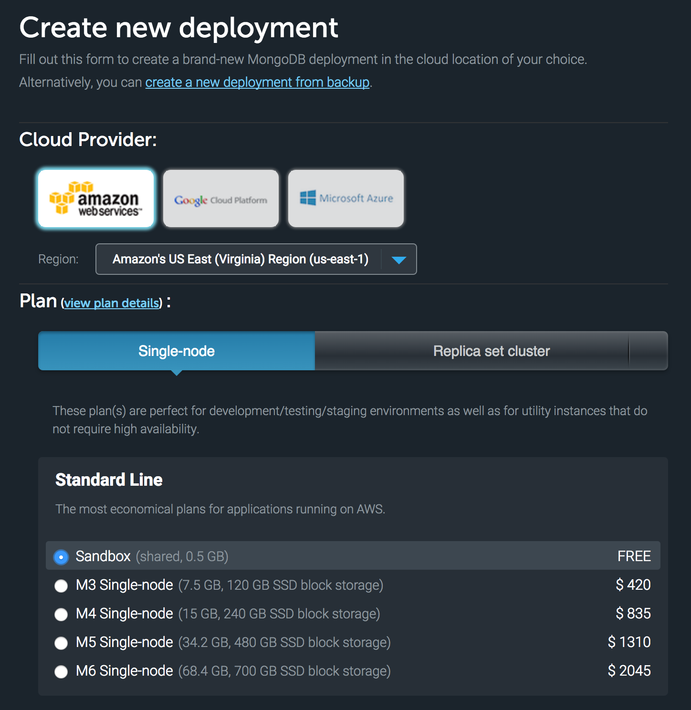
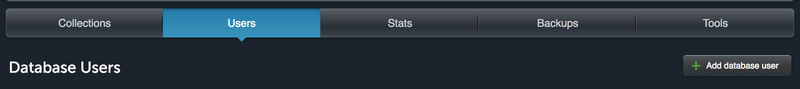

# Mongoose Exercise: Todo List
Mongoose is a `Node.js` library that translates data in the Mongo database to JavaScript objects for use in your application. Let's take a look at creating and storing documents in a collection using MongoDB and Mongoose.

**Note:** For this exercise you will modify your code from the `toDo.js` exercise on Day 1. *Remember* that you stored all of your tasks in a `data.json` file. Now you will have to create an mlab database and re-write the `toDo.js` file to store tasks on your database.

## Set up mLab
1. Navigate to [https://mlab.com/login/](https://mlab.com/login/) and login to your mlab account (create an account if you do not have one).

1. Beside the **MongoDB Deployments** tab press the **Create New** button. Select **Amazon Web Services** as the Cloud Provider, and the *FREE* Sandbox Plan under Plan. Once the correct options have been selected press `Create new MongoDB deployment`.

  

1. Under the **Users** tab you should create a new user. This will make it easier for you to access your database using the MongoDB URI provided at the top of the page.

  

1. Copy the **MongoDB URI** located inside the box at the top of the screen. It should be under the text that says: `To connect using a driver via the standard MongoDB URI (what's this?)`. You will need this for later when you connect to the database using mongoose.

## Connect to MongoDB using mongoose
Open `/week03/day3/todo-mongoose/toDo.js` and look for all of the `TODO` tags and implement missing functionality. **NOTE** be sure to do `npm install` before you begin.

  **REMEMBER** in order to pass a string (task name) into commander in your command line you should use double quotes.

    i.e. node toDo.js delete -t "Do the dishes"

  **REMEMBER** to use the mongoose docs found at [http://mongoosejs.com/index.html](http://mongoosejs.com/index.html).

### Test
Use the `npm test` command to test your functions. The tests could take a long time to run, so please be aware that this is normal.
