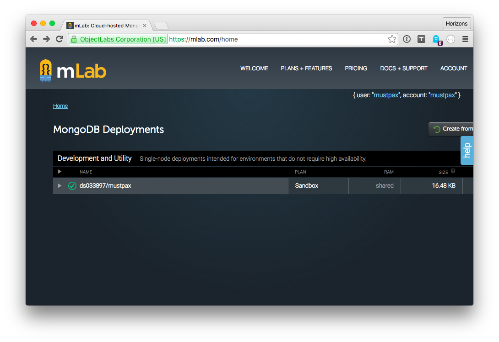
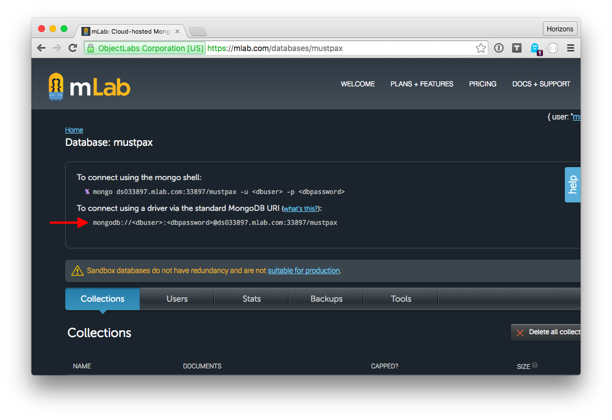
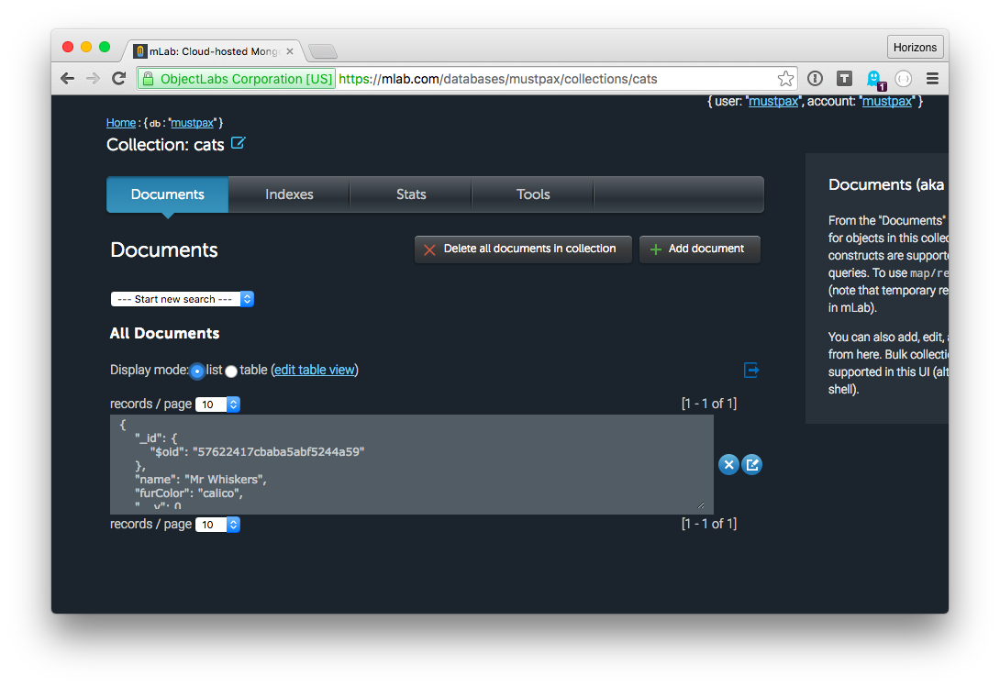

# Inline exercise: Mongoose

## Time limit: 15 minutes

## Goal

Write to and read from MongoDb using a Mongoose model.

## Instructions

1. Login to [mLab](https://mlab.com/home)
1. Click on your database
  
1. Copy the MongoDb URI
  
1. Open `week03/day4/models` and rename `connect_copy.js` to `connect.js`
1. Open `connect.js` and paste the MongoDb URI you copied where it says `MongoDB-URI-HERE`
1. Edit `models.js` and add code to create 3 cats and save them to MongoDb.
  1. Name: Crookshanks Color: Black
  1. Name: Mr. Bigglesworth Color: White
  1. Name: Empurress Color: Calico
1. Run your script and `node models.js` and check output. Use <kbd>Control</kbd>+<kbd>C</kbd> to exit. (Don't forget `npm install` first!)
1. Open mLab, click on your database, click on the `cats` collection, verify that Crookshanks and friends are there.
  
1. Edit `models.js`, write a `Cats.findOne()` query that only returns Mr. Bigglesworth.

### Reading from MongoDb

You can read from MongoDb with Mongoose using `.find()`. This query will return all things named 'Jiggy':

```javascript
var Model = mongoose.model('Model', { name: String });
Model.find({name: "Jiggy"}, function(error, m) { });
```

### Writing to MongoDb

You can write to MongoDb with Mongoose using `.save()`:

```javascript
var Model = mongoose.model('Model', { name: String });
var document = new Model({ name: 'Johnson' });
document.save(function (err) { });
```
